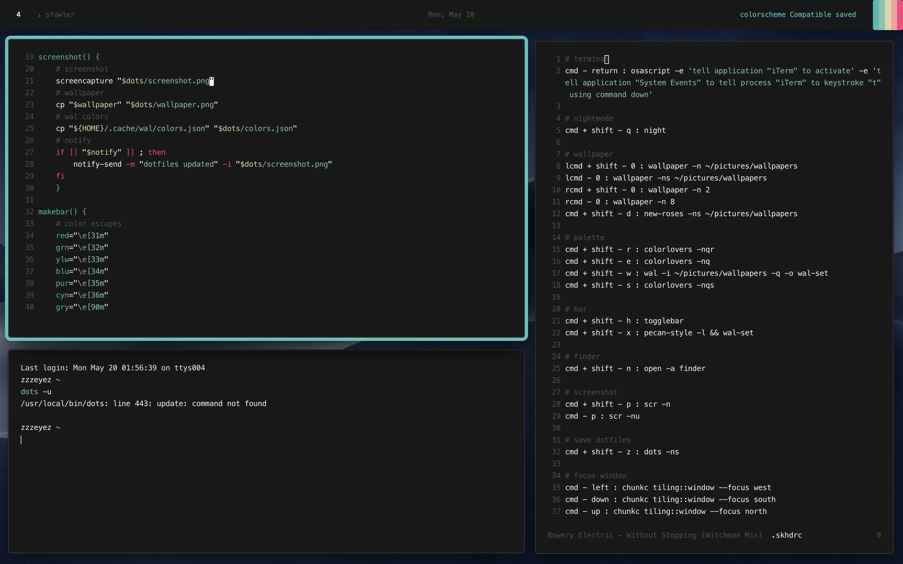

# macos dotfiles

here is the [wallpaper](screenshot/wallpaper.png) and `wal` [colorscheme](screenshot/colors.json) shown in the screenshot. the colorscheme can be loaded with `wal --theme ./colors.json`

## features
+ three-finger dragging, tap to click, two-finger tap to right click
+ vry fast trackpad and key repeat
+ snappy animations + disabled transparency
+ gray highlight and accent colors
+ load random wallpapers, palettes and menubars via keybinds
+ cohesive colors (safari start page, terminals, menubar)

keyboard shortcuts select styles or fetch all my colorschemes and wallpapers from the web.  caps-lock key controls my terminal programs, and cmd key controls everything else.  colors are applied to all my apps via `.scss` files, `sassc`, sourcing `.sh` files

## key bindings
### workspace
+ (cmd + 1-5) switch to workspace 1-5
+ (cmd + shift + 1-5) move window to workspace 1,5 and switch there as well
+ (cmd + arrows) scroll through windows on current worksace
+ (cmd + shift + arrows) move windows on current workspace

### terminal programs
+ (caps-lock) -> alt-key (controls `tmux`, `irssi` `weechat` and `ncmpcpp`
+ (alt + arrows) switch windows (left/right for `tmux`, up/down for rest)
+ (alt + enter) opens tmux windows/sessions depending on iTerm2 window status [tmx](https://github.com/zzzeyez/bin)
+ (alt + w) ^ opposite of that

### wallpapers
+ (cmd + 0) random [wallpaper](https://github.com/zzzeyez/bin) for current workspace
+ (cmd + shift + 0) random `wallpaper` for all workspaces
+ (rcmd + 0) `wal` palette solid color as `wallpaper`
+ (rcmd + shift + 0) download unsplash.com wallpaper via [new-roses](https://github.com/zzzeyez/new-roses)
+ (cmd + shift + d) save `new-roses` wallpaper to ~/pictures/wallpapers

### colorschemes
+ (cmd + shift + w) disable [darkmode](https://github.com/zzzeyez/bin) and download + apply dark palette via [colorlovers](https://github.com/zzzeyez/colorlovers)
+ (cmd + shift + e) enable `darkmode`, download + apply light `colorlovers` palette
+ (cmd + shift + r) load random saved `colorlovers` palette
+ (cmd + shift + s) saves `colorlovers` palette

### menubar + notifications
+ (cmd + shift + x) load random [xanthia](https://github.com/zzzeyez/xanthia) + [pecan](https://github.com/zzzeyez/pecan) style
+ (cmd + shift + h) [toggle](https://github.com/zzzeyez/bin) `xanthia` + `pecan` (also applies `chunkwm` menubar offset via [wal-set](https://github.com/zzzeyez/bin))

## install
i regularly reformat my laptop, run `dots.sh` and pick up where i left off

**./dots.sh** install everything (asking for permission for each task)
+ `./install/brew_packages` list of homebrew packages
+ `./install/macos_settings` list of macos settings
+ `./install/save_home` list of files to save if deleting home directory
+ `./install/save_library` list of files to save if deleting `~/Library`
+ `./install/make_directories` list of folders to recreate if deleting home

~to enable workspace switching you will need to add the 5 workspaces (click the f5 key) and then enable the default shortcuts in system preferences -> keyboard -> shortcuts~ i have decided to switch to `chwmsa` to eliminate animations.  my old `.skhdrc` is still included.

## to do + issues i'm experiencing (maybe you can help)
+ ~caps-lock -> alt-key bind reverts upon reset~.  mapped bash script to iTerm2 hotkey
+ find way to use `defaults write` to hide the Finder sidebar
+ unable to `sudo echo` paths to `/etc/paths.d/paths`
+ `tmux` does not allow binding alt-key with no leader.  currently mapping alt -> ctrl in `skhd`
